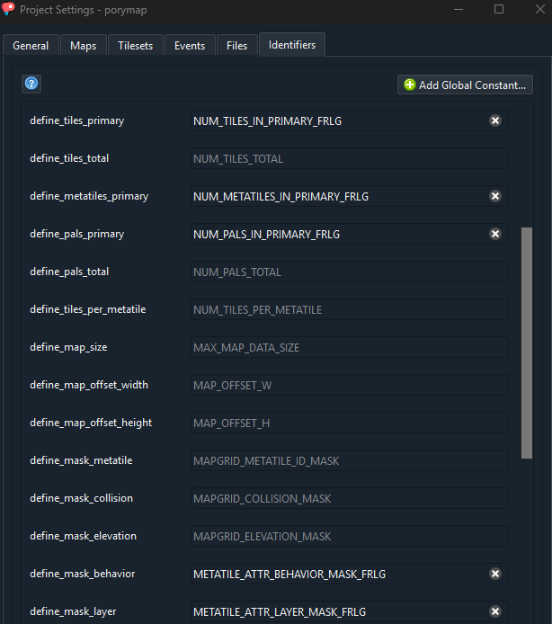
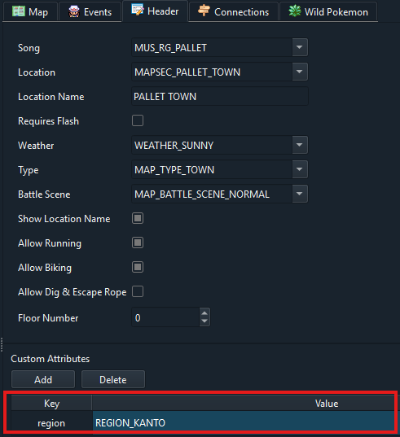

# How to use FireRed/LeafGreen

## How to compile
```make firered -j<output of nproc>```<br>
or<br>
```make leafgreen -j<output of nproc>```

Note: If you switch between building emerald and FRLG, `make clean` is required at the moment.

## Porymap adjustments
For Porymap to work with FRLG maps you need to adjust a few settings (`Options > Project Settings`):
-  in the `General` tab change the base game version to `pokefirered`


- in the `Identifiers` tab change the following attributes:
  - define_tiles_primary: `NUM_TILES_IN_PRIMARY_FRLG`
  - define_metatiles_primary: `NUM_METATILES_IN_PRIMARY_FRLG`
  - define_pals_primary: `NUM_PALS_IN_PRIMARY_FRLG`
  - define_mask_behavior: `METATILE_ATTR_BEHAVIOR_MASK_FRLG`
  - define_mask_layer: `METATILE_ATTR_LAYER_MASK_FRLG`



## How to add maps
For maps to be included in the firered build process they need to have a custom attribute `region` with the value `REGION_KANTO`. Not defining this attribute defaults to `REGION_HOENN`. The attribute can either be added in porymap or manually in the `map.json` file.

**Examples:**

map.json:
```
{
  "id": "MAP_PALLET_TOWN",
  "name": "PalletTown_Frlg",
  "layout": "LAYOUT_PALLET_TOWN",
  "music": "MUS_RG_PALLET",
  "region": "REGION_KANTO",
  ...
```
Porymap:



## Migrating FRLG tilesets
To migrate tilesets that have been previously created for pokefirered you can use [this script](/migration_scripts/frlg_metatile_behavior_converter.py).<br>
Instructions are in the script.
